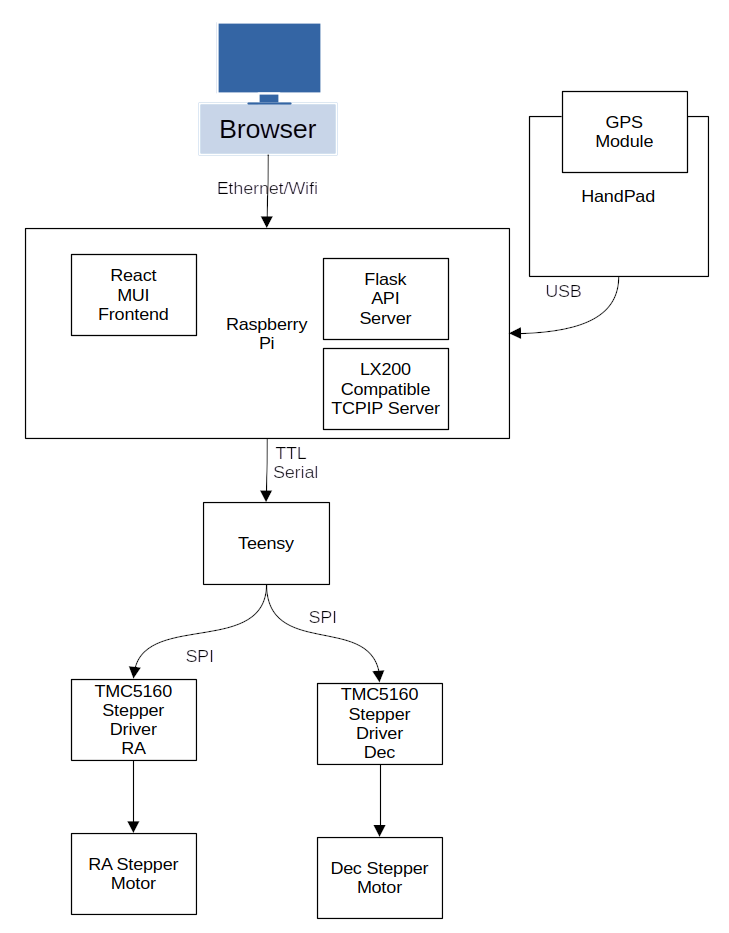

# SST Forkmount

This repo contains the electronic designs and software for [StarSync Trackers](https://starsynctrackers.com/)
computerized forkmount equatorial mounts.

## Component Structure

Below it tries to describe

* Computer connects to the mount through Ethernet or Wifi and control the telescope in one of the following ways.
    * A web browser [SST Discovery Tool](https://github.com/bluthen/SSTForkMountDiscovery)
    * software capable of communicating through a LX200 protocol
* Handpad is a device attached through a USB cable
    * It has a GPS moduled embedded inside it that can give the telescope accurate time and location.
    * Has a interface to control the telescope without a computer attached, with goto and manual slew functions.
* Raspberry pi has a controller board (Pi Hat) attached to it and has three main components.
    * Flask API Server - Provides a REST like API to control the telescope
    * React MUI Frontend - web based user interface to communcate with the API Server
    * LX200 Compatible TCPIP Server - An alternative way to control the telescope through a dedicated TCP/IP Port.
* Motor Control Chain
    * Microcontroller (Teensy) - The Raspberry pi has a controller board attached and communicates with it through TTL
      Serial.
    * The Microcontroller (Teensy) - communicates with stepper drivers using SPI Protocol and step/direction protocol.
    * The stepper drivers (TMC5160) - controls the RA/Dec steppers to point the telescope

# Project directory structure

* [electronics](electronics) - Files related to the hardware of: Handpad, serial to ethernet, main controller
    * [enclosures](electronics/enclosures) - Enclosures to house electronics
    * [firmware](electronics/firmware) - Microcontroller firmware
    * [pcb](electronics/pcb) - Schematic and PCB files
* [piside](piside) - Software the run on the Pi.
    * [client_advanced_slew_limits](piside/client_advanced_slew_limits) - Slew limits UI component
    * [client_main](pisiude/client_main) - The Material UI web client
    * [server](piside/server) - Flask API Server