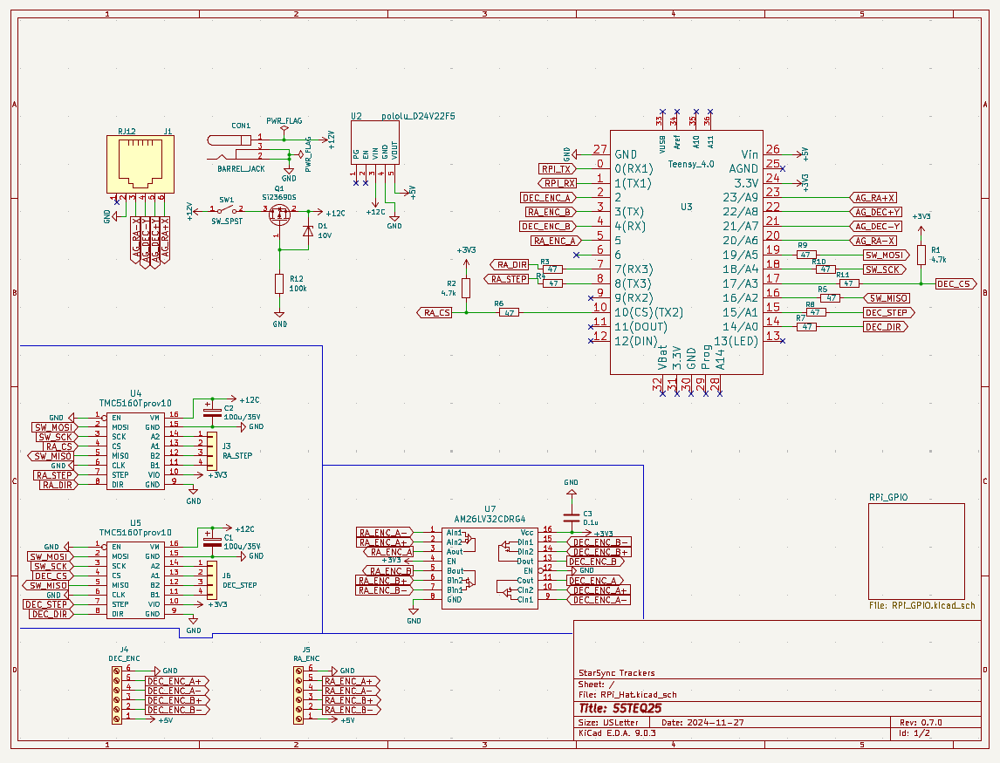
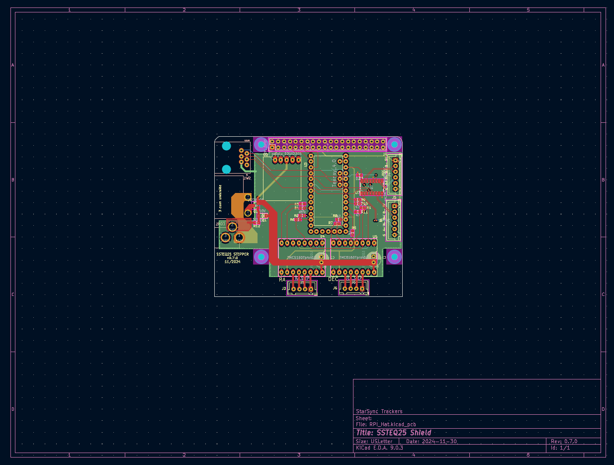
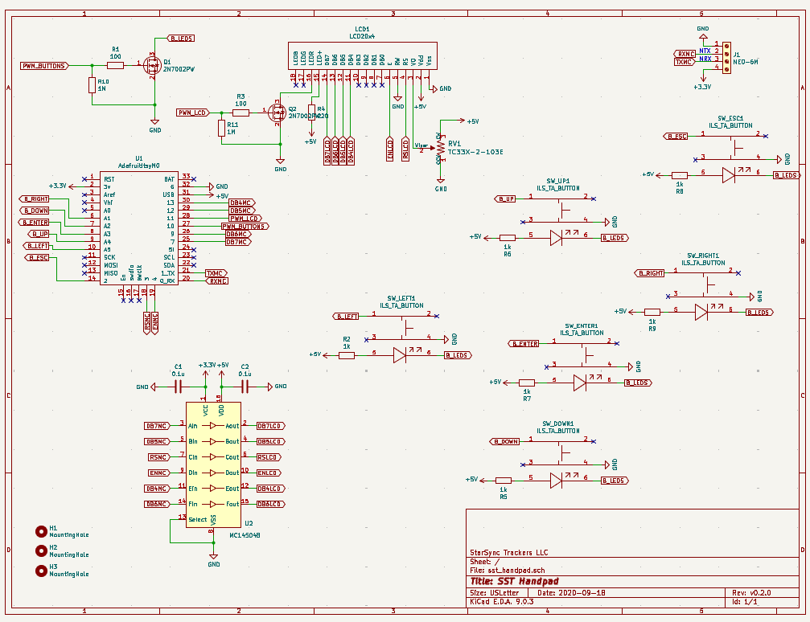
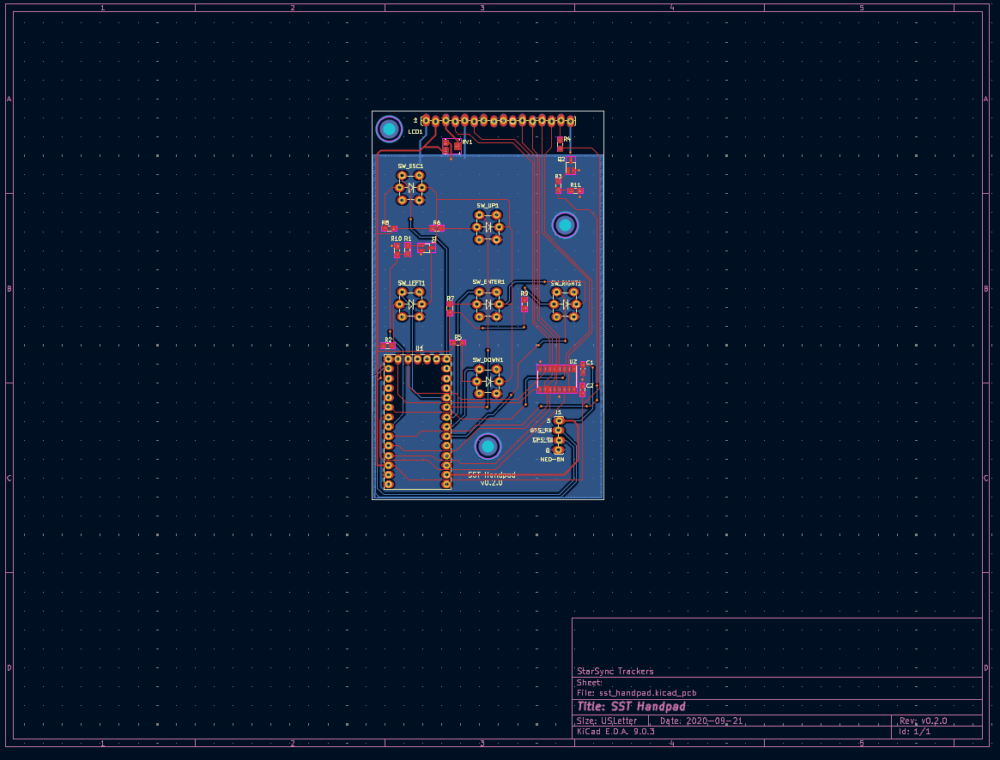

# PCBs and Schematics

The PCBs are made in an Open Source Electronics Design Suite [KiCad](https://kicadstudio.com/).

## PiHat (Motor Controller)

The device that takes communication from the Pi that controls the stepper motors.

## Handpad

Handpad that lets you control the mount without a computer. Useful when next to the mount or using it for visual work.

# Directory Structure

* [BOM](BOM) - Bill Of Materials - spreadsheets of electronics components needed to build the device.
* [handpad](handpad) - KiCad handpad files.
* [PiHat](PiHat) - KiCad PiHat (Motor Controller) files. 