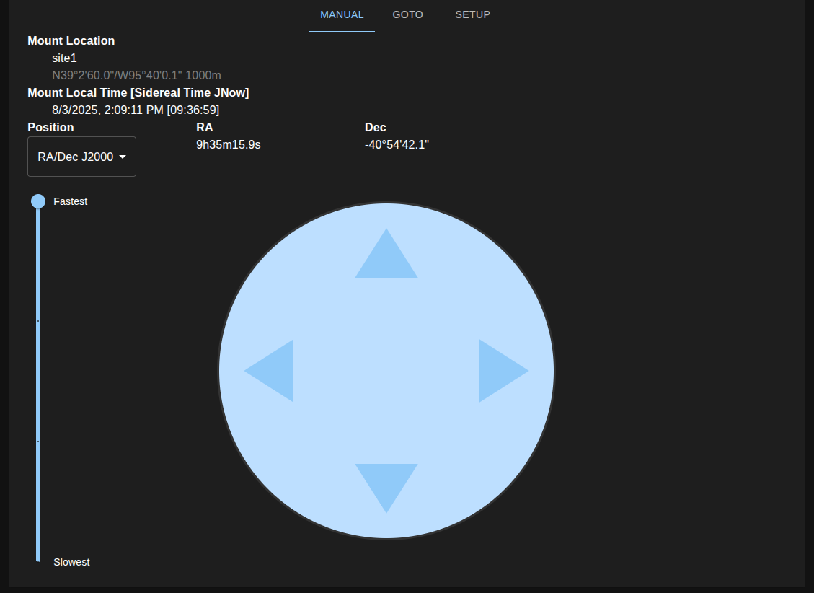
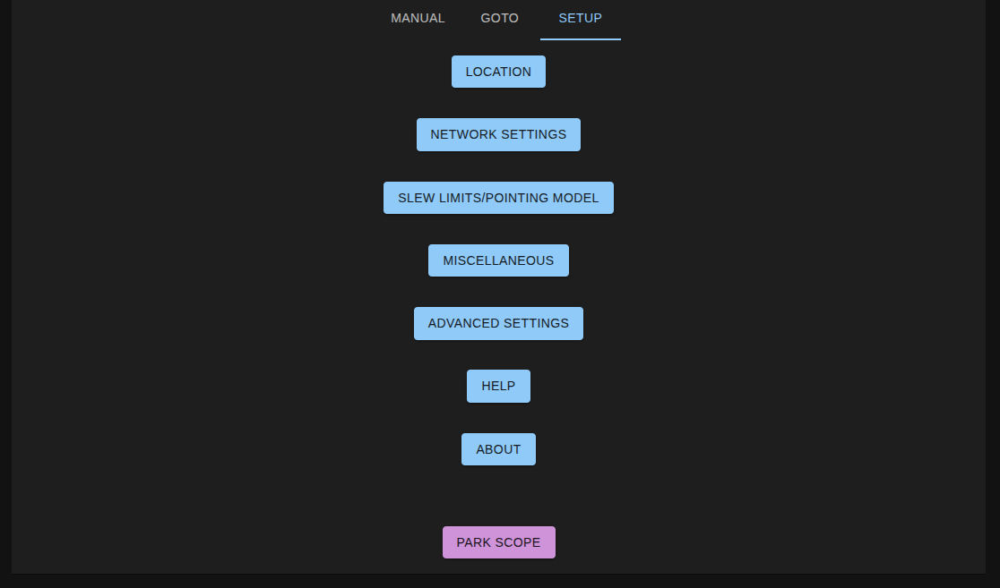

# PiSide - Software that runs on the Pi






# Docker compose

You can run the software in docker with a simulated microcontroller board.

* `settings.json` - needs to be set up correctly
* `ssteq.sqlite` - needs to be generated (gen script and documentation are on TODO list)
* `server/simulation_files` - may need to be set up

```bash
docker compose build
docker compose up
```

Open browser to: [http://localhost:5001](http://localhost:5001)

# Package Management: Local Development vs on Pi

Two package managers are used depending on if you are development on your desktop or development/running on the Pi.
Mainly so the package manager could be configured to utilize [Pi Wheels](https://www.piwheels.org/)

* [Pipenv](https://pipenv.pypa.io/en/latest/) was used for dependencies on the PI. Here we are able to
  utilize [Pi Wheels](https://www.piwheels.org/)
* [Poetry](https://python-poetry.org/) is used for desktop development

# Directory structure

* [server](server) - API Server
* [client_main](client_main) - Material UI based web client
* [client_advanced_slew_limits](client_advanced_slew_limits) - A web interface sub app to set slew limits written in
  jquery
* [setup](setup) - Setup documentation and files